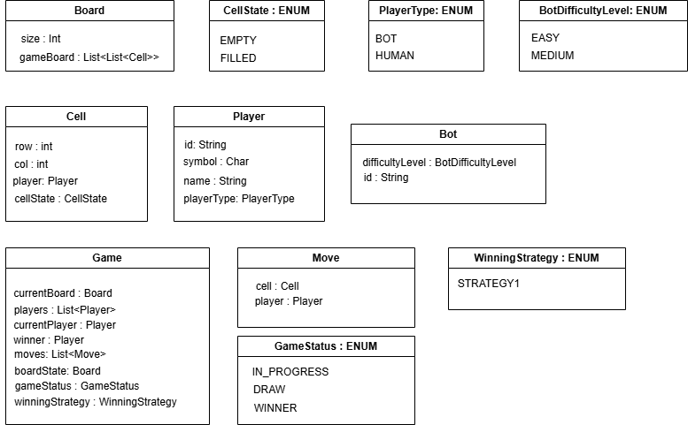

# TicTacToe

## Game Design checklist

1. Board - Size of board & initialization logic(eg. for snake ladder game we will initialize)
2. LeaderBoard - Maintain a list of top winners.
3. Tournaments
4. Pause/Resume a game.
5. Exit the game in between.
6. Timer in the game.
7. Undo.
8. Replay.
9. How does a game start, and how does a game end.
10. Strategies to find the winner,runner-up etc.

## Requirement gathering

1. Non-persistent system, We don't need any DB.
2. Size of Board = N x N, number of player = N-1, number of symbols = N-1
3. How do the game start, who has the first turn? 
   1. We can randomly pick on turns. 
4. We will have a bot, so that a single player can also play the game.
5. Bot can have multiple playing strategies:
   1. Easy winning strategy, Medium winning strategy
6. How do we win the game?
   1. If a row,column and diagnol has same sign.
   2. If all the 4 corners has same sign.
7. No one can exit the game in between.
8. User can undo a move.
   1. Any player can undo a move.
   2. They can undo as many times they want.
9. User should be able to play the history of their moves.

## How can we implement Undo strategy?

1. Strategy 1 - 
   1. We keep a list of moves. [[0,0,x], [1,1,o],[2,2,x]]
   2. When we want to undo, we update the board from backward.
   3. Pros : 
      1. Space efficient, we only same the moves.
   4. Cons : 
      1. If we calculate score after every move, then a lot of calculations needs to be done.
2. Strategy 2 -
   1. We keep a list of moves. [[0,0,x], [1,1,o],[2,2,x]]
   2. When we undo a move, we remove the moves from list. And construct the board from the beginning.
   3. Pros:
      1. If the score calculation is very difficult, and is dependent on previous moves.
      2. eg. if we have 2 wins in  a row we have the double the points etc.
   4. Cons:
      1. TC is going to be very large, as we construct the board again and again.
3. Strategy 3 -
    1. We keep a list of moves and List of board state after every move.
       1. List<Move> = [[0,0,x], [1,1,o],[2,2,x]]
       2. List<Board> = [[[x,_,_],[_,_,_],[_,_,_]],[[x,_,_],[_,o,_],[_,_,_]],[[x,_,_],[_,o,_],[_,_,x]]]
    2. When we undo a move, we remove the moves from list. And go the state of board at that time.
    3. Pros:
        1. Easy to implement.
        2. TC is good.
    4. Cons:
        1. SC is bad.

## Finding winner algo

### Idea 1 

1. We check the board after every move.
2. So after a move, we need to check NxN board for all the N-1 symbols.
3. TC - N^3.

### Idea 2

1. Instead of checking the whole board, we just check the row,column and diagnol which is where the last move was made.
2. We can create a HashMap - 
   1. Row hashmaps - Stores symbol and count for each row. (N) rows and (N-1) symbols.
   2. Column hashmaps - Stores symbol ad count for each column.  (N) columns and (N-1) symbols.
   3. Diagonal hashmaps - 2 maps.
   4. Corner Hashmap - 1 map
3. SC - 
   1. (2N + 3) = Hashmaps.
   2. for each map - we have (N-1) entries, one for each symbol.
   3. (2N + 3)*(N - 1) entries
4. TC -
   1. After every move, we update hashmaps.
   2. And we only need to update 4 HMs, and we check the count.
   3. TC - O(1)

## Class Diagram

## Design Patterns

1. Game - Builder Pattern, Do validations while building board.
   1. Each player has unique symbol.
   2. Maximum 1 bot per game.
   3. N size, N-1 players.
2. BotWinningStrategy, WinningStrategy - Strategy Pattern

